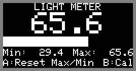
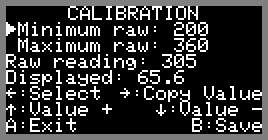

# Light Meter Sketch for the Arduboy

By Scott Allen

## Description

This sketch turns an [Arduboy miniature game system](https://arduboy.com/ "Arduboy Homepage") into a crude light meter by using the red LED of the RGB LED as a sensor.

An LED will emit light when you pass a current through it but most will also work in reverse. If the LED receives light, it will generate a very small current. This program uses the microcontroller's ADC to read the voltage produced by the LED, which will vary in accordance to the intensity of the light shining on it.

Some calibration is supported, to adjust the scaling. Minimum and maximum raw reading values can be set to define the zero and 100% points for the displayed scaled value and bar graph. The program saves and retrieves default calibration values in EEPROM and altered values can be saved to replace them.

## Screenshots

   

